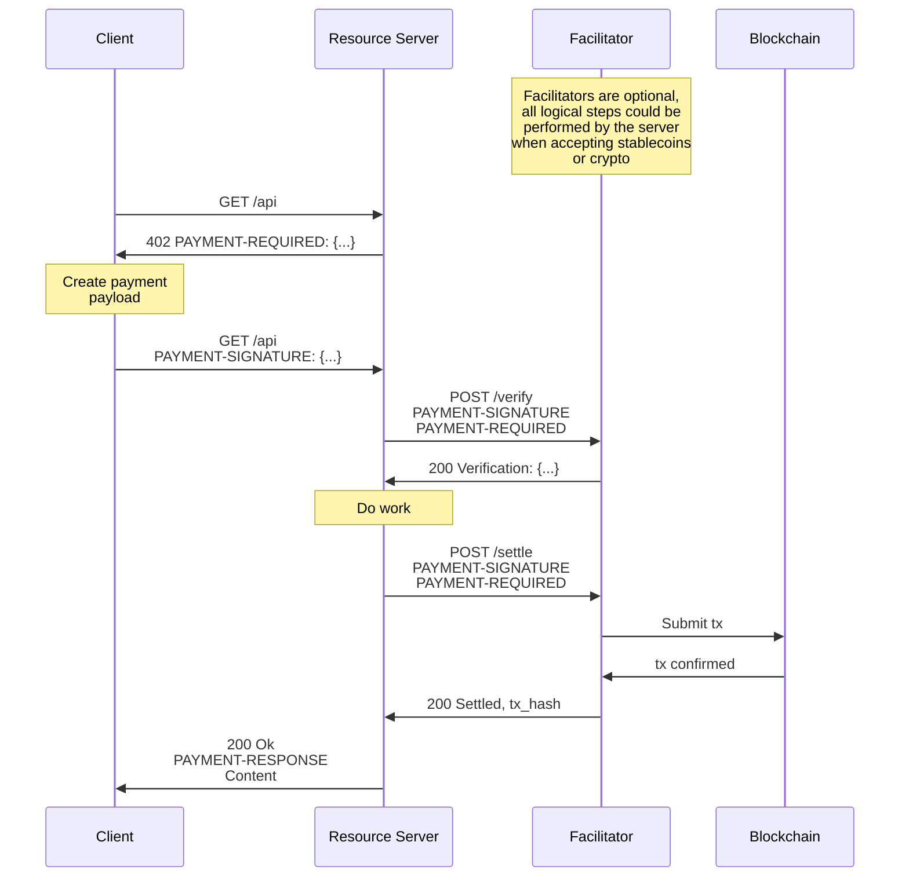

# x402

x402 is an open-source SDK for the [**x402 open payment standard**](https://www.x402.org/) — a protocol built on the HTTP `402 Payment Required` status code. It enables web services to charge for APIs or content through a "pay-before-response" mechanism — without relying on traditional account systems or session management.

x402 currently supports the **TRON** and **BSC** networks, with plans to expand to a broader multi-chain ecosystem in the future.

---

**[📚 Full Documentation](https://docs.bankofai.io/)**

---

## Current Release

Version `1.2.0`. The SDK is a **TypeScript-only** pnpm/turbo monorepo published as granular `@bankofai/x402-*` packages (there is no umbrella package). `core` and the EVM mechanism are forks of the [`x402-foundation/x402`](https://github.com/x402-foundation/x402) upstream; the TRON mechanism is in-house. Supported schemes: `exact` (ERC-3009 / Permit2), `upto`, `batch-settlement`, `auth-capture` (EVM), and `exact_gasfree` (TRON). See [the v1.2.0 release notes](RELEASE_NOTES.md#v120--tron-approval-resource-sponsoring) for upgrade details.

> The previous-generation Python + TypeScript SDK lives under [`legacy/`](legacy/) for reference and is slated for removal.

## Features

- **Protocol Native**: Restores the HTTP `402` status code to its intended purpose.
- **AI Ready**: First-class support for AI Agents via specialized x402 skills.
- **Trust Minimized**: Uses **TIP-712/EIP-712** structured data signing. Facilitators cannot modify payment terms.
- **Stateless & Accountless**: No user accounts or session management required. Payments are verified per request.
- **Framework Integrations** (TypeScript): a wrapped-`fetch` client plus middleware for **Express, Fastify, Hono, Next.js, Axios**, and an **MCP** transport.

## Installation

Install only the granular packages you need:

```bash
# client (wrapped fetch) + the chains you pay on
npm install @bankofai/x402-fetch @bankofai/x402-evm @bankofai/x402-tron

# resource server (Express shown; also fastify/hono/next/axios)
npm install @bankofai/x402-core @bankofai/x402-express
```

The repo itself is a `pnpm` (>=11) workspace; from `typescript/` run `pnpm install && pnpm build`. The `examples/` workspace links these packages and builds from source.

## Quick Start

A full loop has three roles: **Client** (payer), **Resource Server** (seller), **Facilitator** (verify + settle on-chain). Runnable trios for every scheme live under [`examples/typescript/`](examples/typescript/) — start there.

### Client (Buyer)

The client wraps `fetch` so `402` challenges are paid automatically. Key custody is in [`@bankofai/agent-wallet`](https://github.com/BofAI/agent-wallet); the signer factory adapts the wallet and builds the chain client internally from the CAIP-2 network.

**TRON (Nile) example:**

```typescript
import { x402Client, wrapFetchWithPayment } from "@bankofai/x402-fetch";
import { createClientTronSigner } from "@bankofai/x402-tron";
import { ExactTronScheme } from "@bankofai/x402-tron/exact/client";

const wallet = /* resolve your @bankofai/agent-wallet */;
// The factory builds TronWeb from the network and auto-broadcasts the one-time
// Permit2 approve that USDT/USDD need. When TRON_GRID_API_KEY is unset, mainnet
// RPC falls back to a BankofAI-operated endpoint.
const signer = await createClientTronSigner(wallet, {
  network: "tron:0xcd8690dc",
  apiKey: process.env.TRON_GRID_API_KEY,
});

// The selector is the payment-selection policy: pick which advertised option to pay.
const client = new x402Client((_x402Version, accepts) => accepts[0]);
client.register("tron:*", new ExactTronScheme(signer));

const fetchWithPay = wrapFetchWithPayment(fetch, client);
const res = await fetchWithPay("http://localhost:4021/weather"); // 402 handled automatically
const data = await res.json();
```

**EVM (BSC)** is symmetric — swap the imports and register under the exact chain id:

```typescript
import { createClientEvmSigner } from "@bankofai/x402-evm/adapters/agent-wallet";
import { ExactEvmScheme } from "@bankofai/x402-evm/exact/client";

const signer = await createClientEvmSigner(wallet, {
  network: "eip155:97",
  // Permit2 tokens (e.g. USDC) read the chain; set a reliable RPC.
  // ERC-3009 tokens (e.g. DHLU) sign offline and need none.
  rpcUrl: "https://bsc-testnet-rpc.publicnode.com",
});
client.register("eip155:97", new ExactEvmScheme(signer));
```

### Server (Seller)

Build a resource server with `createResourceServer` (from `@bankofai/x402-core`), point it at a facilitator via `HTTPFacilitatorClient` (`@bankofai/x402-core/server`), and protect routes with the framework middleware — e.g. `paymentMiddlewareFromHTTPServer` from `@bankofai/x402-express`. The server is keyless (it only holds a payout address). Facilitator requests default to a 90-second timeout; set `timeoutMs` explicitly when your chain or deployment needs a different bound. See [`examples/typescript/servers/express`](examples/typescript/servers/express) for the full wiring.

### Facilitator

The facilitator verifies signatures and settles on-chain. Construct `new x402Facilitator()` (from `@bankofai/x402-core/facilitator`) and `register(network, scheme)` per chain with a facilitator signer. Self-host it, or use the [officially hosted Facilitator](https://github.com/BofAI/x402-facilitator). See [`examples/typescript/facilitator/basic`](examples/typescript/facilitator/basic).

## AI Agent Integration

x402 is designed for the Agentic Web. AI agents can autonomously negotiate and pay for resources using the [**x402-payment**](https://github.com/BofAI/skills/tree/main/x402-payment) skill, which lets agents detect `402` responses, sign TIP-712/EIP-712 authorizations, and manage the challenge-response loop.

**Configuration:** set up [`agent-wallet`](https://github.com/BofAI/agent-wallet) and let the signer factories resolve the active wallet. When `TRON_GRID_API_KEY` is unset, mainnet TRON RPC routes to a BankofAI-operated fallback (`https://hptg.bankofai.io`); set it for production.

```bash
export AGENT_WALLET_PRIVATE_KEY="your_private_key_here"
export TRON_GRID_API_KEY="your_trongrid_api_key_here"  # recommended for production
```

## Architecture

The x402 protocol involves three parties:

- **Client**: Entity wanting to pay for a resource
- **Resource Server**: HTTP server providing protected resources
- **Facilitator**: Server that verifies and settles payments on-chain

### Payment Flow



## Supported Networks & Assets

x402 currently supports TRC-20 tokens on the TRON network and BEP-20 tokens on the BSC network.

| Network | ID | Status | Recommended For |
|---------|----|--------|-----------------|
| **TRON Nile** | `tron:0xcd8690dc` | Testnet | **Development & Testing** |
| **TRON Shasta** | `tron:0x94a9059e` | Testnet | Alternative Testing |
| **TRON Mainnet** | `tron:0x2b6653dc` | Mainnet | Production |
| **BSC Testnet** | `eip155:97` | Testnet | **Development & Testing** |
| **BSC Mainnet** | `eip155:56` | Mainnet | Production |

**Tokens seen in the examples:** BSC testnet — `DHLU` (ERC-3009) and `USDC` (Permit2); TRON Nile — `USDT` and `USDD` (Permit2).

## Supported Payment Schemes

| Scheme | Chain | Description |
|--------|-------|-------------|
| **`exact`** | EVM, TRON | Fixed, pre-quoted single payment. Transfer method chosen via `extra.assetTransferMethod`: `eip3009` (ERC-3009 `TransferWithAuthorization`, e.g. USDC/DHLU) or `permit2` (Uniswap Permit2). |
| **`upto`** | EVM, TRON | Usage-based: the payer signs an up-to-max authorization; the server settles the actual amount used (≤ max). |
| **`batch-settlement`** | EVM, TRON | Payment channels: deposit once, pay many requests with off-chain vouchers, settle a batch (with refund of the remainder). |
| **`auth-capture`** | EVM | Refundable payments via Base's Commerce Payments escrow — authorize, then capture / void / refund. |
| **`exact_gasfree`** | TRON | Pay with USDT/USDD without holding TRX for gas; a relayer submits and pays energy via the official GasFree Proxy. |

## Development

### Prerequisites
- Node.js 22+
- `pnpm` >= 11
- A TRON wallet with TRX for gas/energy, and/or a BSC wallet with BNB for gas.

### Build & test
```bash
cd typescript
pnpm install
pnpm build           # turbo run build (all packages → dist/, gitignored)
pnpm build:release   # bypass build cache before packing/publishing
pnpm test            # vitest unit tests (offline, no secrets)
pnpm test:integration  # real-chain tests; self-skip without .env creds
```

Use `pnpm build:release` before `pnpm pack` or `pnpm publish`. The forced build lets each package clean its output first, preventing stale hashed declaration files from entering release tarballs.

### Configuration
- Configure wallet access through [`agent-wallet`](https://github.com/BofAI/agent-wallet).
- `TRON_GRID_API_KEY`: recommended for production. When unset, mainnet TRON RPC uses a BankofAI fallback endpoint automatically.

## Security & Risk

> [!WARNING]
> **Use at your own risk.** Handling private keys involves significant risk of asset loss.
>
> - **Never commit secrets**: Do not hardcode private keys or commit `.env` files to version control.
> - **Wallet Isolation**: Use dedicated wallets for development with only necessary funds.
> - **Environment Variables**: Always use environment variables or secure vaults to manage sensitive credentials.
> - **Protocol Status**: x402 is in active development. Ensure you test thoroughly on Nile or Shasta testnets before any mainnet deployment.

## Contributing

We welcome contributions! Please see [CONTRIBUTING.md](./CONTRIBUTING.md) for guidelines.

## License

MIT License - see [LICENSE](./LICENSE) for details.
