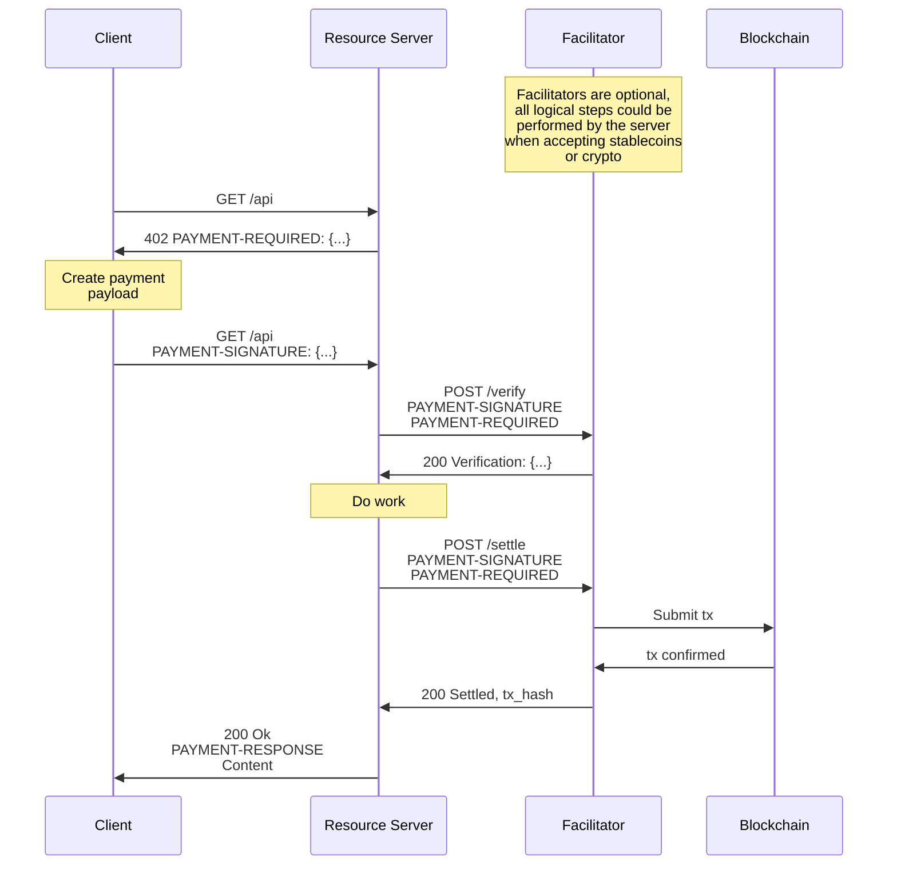

# x402

x402 is an open-source SDK for the [**x402 open payment standard**](https://www.x402.org/) — a protocol built on the HTTP `402 Payment Required` status code. It enables web services to charge for APIs or content through a "pay-before-response" mechanism — without relying on traditional account systems or session management.

x402 currently supports the **TRON** and **BSC** networks, with plans to expand to a broader multi-chain ecosystem in the future.

---

**[📚 Full Documentation](https://docs.bankofai.io/)** | **[💻 Demo Repository](https://github.com/BofAI/x402-demo)**

---

## Features

- **Protocol Native**: Restores the HTTP `402` status code to its intended purpose.
- **AI Ready**: First-class support for AI Agents via specialized x402 skills.
- **Trust Minimized**: Uses **TIP-712/EIP-712** structured data signing. Facilitators cannot modify payment terms.
- **Stateless & Accountless**: No user accounts or session management required. Payments are verified per request.
- **Framework Integrations**: 
    - **Python**: FastAPI, Flask, httpx
    - **TypeScript**: Native fetch, Node.js

## Compatibility Notes

- The `exact` scheme is being aligned to the Coinbase x402 v2 wire format.
- For `exact`, transfer authorization data is now carried in `payload.authorization`.
- A temporary fallback still accepts the legacy `extensions.transferAuthorization` shape during migration.

## Installation

### Python
The Python SDK includes support for Server (FastAPI/Flask), Client, and Facilitator.

```bash
# Clone the repository
git clone https://github.com/BofAI/x402.git
cd x402/python/x402

# Install with all dependencies
pip install -e .[all]
```

### TypeScript
The TypeScript SDK provides client-side integration tools.

```bash
npm install @bankofai/x402
```

## AI Agent Integration

x402 is designed for the Agentic Web. AI agents can autonomously negotiate and pay for resources using the [**x402-payment**](https://github.com/BofAI/skills/tree/main/x402-payment) skill.

This skill enables agents to:

1. Detect `402 Payment Required` responses.
2. Sign TIP-712/EIP-712 payment authorizations automatically.
3. Manage wallet balances and handle the challenge-response loop.

## Quick Start

### 1. Facilitator
The Facilitator is responsible for verifying TIP-712/EIP-712 signatures and executing on-chain settlements.

- **Self-Hosted**: Deploy and manage your own Facilitator instance for full control over fee policies and settlement strategies. See the [**demo repository quick start**](https://github.com/BofAI/x402-demo/tree/main?tab=readme-ov-file#quick-start) for deployment instructions.
- **Official Facilitator**: An [officially hosted Facilitator](https://github.com/BofAI/x402-facilitator) service is available, allowing you to use x402 without deploying infrastructure yourself.

### 2. Server (Seller)
Protect your FastAPI endpoints with a single decorator.

**TRON Example:**
```python
from fastapi import FastAPI
from bankofai.x402.server import X402Server
from bankofai.x402.fastapi import x402_protected
from bankofai.x402.facilitator import FacilitatorClient
from bankofai.x402.config import NetworkConfig

app = FastAPI()
server = X402Server()
server.set_facilitator(FacilitatorClient("http://localhost:8001"))

@app.get("/protected")
@x402_protected(
    server=server,
    prices=["0.0001 USDT"],
    schemes=["exact_permit"],
    network=NetworkConfig.TRON_NILE,
    pay_to="<YOUR_TRON_WALLET_ADDRESS>",
)
async def protected_endpoint():
    return {"data": "This is premium content!"}
```

**EVM (BSC) Example:**
```python
from fastapi import FastAPI
from bankofai.x402.server import X402Server
from bankofai.x402.fastapi import x402_protected
from bankofai.x402.facilitator import FacilitatorClient
from bankofai.x402.config import NetworkConfig
from bankofai.x402.mechanisms.evm.exact_permit import ExactPermitEvmServerMechanism
from bankofai.x402.mechanisms.evm.exact import ExactEvmServerMechanism

app = FastAPI()
server = X402Server()
server.register(NetworkConfig.BSC_TESTNET, ExactPermitEvmServerMechanism())
server.register(NetworkConfig.BSC_TESTNET, ExactEvmServerMechanism())
server.set_facilitator(FacilitatorClient("http://localhost:8001"))

@app.get("/protected")
@x402_protected(
    server=server,
    prices=["0.0001 USDT", "0.0001 DHLU"],
    schemes=["exact_permit", "exact"],
    network=NetworkConfig.BSC_TESTNET,
    pay_to="<YOUR_BSC_WALLET_ADDRESS>",
)
async def protected_endpoint():
    return {"data": "This is premium content!"}
```

For a smoke-tested BSC testnet example set, see [`examples/bsc-testnet-smoke/README.md`](examples/bsc-testnet-smoke/README.md). The `exact` route there uses `DHLU`, which supports ERC-3009 on testnet.

### 3. Client (Buyer)
Clients handle the `402` challenge-response loop automatically using the SDK.

 **TRON — TypeScript Example:**
 ```typescript
 import 'dotenv/config'
 import {
   X402Client, X402FetchClient,
   ExactPermitTronClientMechanism, ExactGasFreeClientMechanism,
   TronClientSigner, SufficientBalancePolicy,
   GasFreeAPIClient, getGasFreeApiBaseUrl,
 } from '@bankofai/x402'

 const signer = await TronClientSigner.create()

 const x402 = new X402Client()

 // Register both exact_permit and exact_gasfree mechanisms
 x402.register('tron:*', new ExactPermitTronClientMechanism(signer))
 x402.register('tron:*', new ExactGasFreeClientMechanism(signer, {
   'tron:nile': new GasFreeAPIClient(getGasFreeApiBaseUrl('tron:nile')),
   'tron:mainnet': new GasFreeAPIClient(getGasFreeApiBaseUrl('tron:mainnet')),
 }))
 x402.registerPolicy(SufficientBalancePolicy)

 const client = new X402FetchClient(x402)

 // The SDK handles the 402 flow automatically
 // Demo service: https://x402-demo.bankofai.io/protected-nile
 const response = await client.get('http://localhost:8000/protected')
 const data = await response.json()
 ```

 **TRON — Python Example:**
 ```python
 import asyncio, httpx
 from bankofai.x402.clients import X402Client, X402HttpClient, SufficientBalancePolicy
 from bankofai.x402.mechanisms.tron.exact_permit import ExactPermitTronClientMechanism
 from bankofai.x402.mechanisms.tron.exact_gasfree.client import ExactGasFreeClientMechanism
 from bankofai.x402.signers.client import TronClientSigner
 from bankofai.x402.utils.gasfree import GasFreeAPIClient
 from bankofai.x402.config import NetworkConfig

 gasfree_clients = {
     "tron:nile": GasFreeAPIClient(NetworkConfig.get_gasfree_api_base_url("tron:nile")),
     "tron:mainnet": GasFreeAPIClient(NetworkConfig.get_gasfree_api_base_url("tron:mainnet")),
 }

 async def main():
     signer = await TronClientSigner.create()

     x402 = X402Client()
     x402.register("tron:*", ExactPermitTronClientMechanism(signer))
     x402.register("tron:*", ExactGasFreeClientMechanism(signer, clients=gasfree_clients))
     x402.register_policy(SufficientBalancePolicy)

     async with httpx.AsyncClient(timeout=120) as http:
         client = X402HttpClient(http, x402)
         response = await client.get("http://localhost:8000/protected")
         print(response.json())

asyncio.run(main())
```

 **EVM (BSC) — TypeScript Example:**
 ```typescript
 import 'dotenv/config'
 import {
   X402Client, X402FetchClient,
   ExactPermitEvmClientMechanism, ExactEvmClientMechanism,
   EvmClientSigner, SufficientBalancePolicy,
 } from '@bankofai/x402'

 const signer = await EvmClientSigner.create()

 const x402 = new X402Client()
 x402.register('eip155:*', new ExactPermitEvmClientMechanism(signer))
 x402.register('eip155:*', new ExactEvmClientMechanism(signer))
 x402.registerPolicy(SufficientBalancePolicy)

 const client = new X402FetchClient(x402)

 // The SDK handles the 402 flow automatically
 // Use an endpoint that advertises an ERC-3009-compatible token for `exact`
 const response = await client.get('http://localhost:8000/protected-bsc-testnet-coinbase')
 const data = await response.json()
 ```

The BSC testnet smoke path validated on 2026-04-03 was:

- Coinbase official client -> our server
- our client -> Coinbase official server

Runbook and txids are documented in [`examples/bsc-testnet-smoke/README.md`](examples/bsc-testnet-smoke/README.md) and [`specs/001-exact-v2-compat/quickstart.md`](specs/001-exact-v2-compat/quickstart.md).

### 4. Agent (Buyer)
 AI agents can handle x402 payments autonomously by using the specialized payment skill.

 **Configuration:**
 Configure `agent-wallet` first, then let the signer factories resolve the active wallet. For wallet setup instructions and supported configuration modes, see `https://github.com/BofAI/agent-wallet`.

 When `TRON_GRID_API_KEY` is not set, mainnet RPC calls are automatically routed to a BankOfAI-operated fallback endpoint (`https://hptg.bankofai.io`). Setting `TRON_GRID_API_KEY` uses TronGrid directly and is recommended for production workloads.

 ```bash
 # Example: configure agent-wallet via environment
 # See https://github.com/BofAI/agent-wallet for the full setup guide
 export AGENT_WALLET_PRIVATE_KEY="your_private_key_here"
 export TRON_GRID_API_KEY="your_trongrid_api_key_here"  # Recommended for production
 ```

**Using with Agentic Tools:**
You can add the [**x402-payment**](https://github.com/BofAI/skills/tree/main/x402-payment) skill to your favorite agentic tools:

- **OpenClaw**: `npx clawhub install x402-payment`
- **opencode**: Copy the skill to your project's `.opencode/skill/` directory to enable autonomous TRON payments.

Once configured, your agent will:
1. Automatically detect when an API requires payment (`402`).
2. Negotiate terms and sign authorizations using the provided wallet.
3. Manage gas (TRX) and token (USDT/USDD) balances to ensure smooth operation.

**Try it out:** Tell your Agent to visit `https://x402-demo.bankofai.io/protected-nile`. The Agent will automatically complete the x402 payment and return the resource.

## Architecture

The x402 protocol involves three parties:

- **Client**: Entity wanting to pay for a resource
- **Resource Server**: HTTP server providing protected resources
- **Facilitator**: Server that verifies and settles payments on-chain

### Payment Flow



## Supported Networks & Assets

x402 currently supports TRC-20 tokens on the TRON network and BEP-20 tokens on the BSC network. Custom tokens can be registered via the `TokenRegistry`.

| Network | ID | Status | Recommended For |
|---------|----|--------|-----------------|
| **TRON Nile** | `tron:nile` | Testnet | **Development & Testing** |
| **TRON Shasta** | `tron:shasta` | Testnet | Alternative Testing |
| **TRON Mainnet** | `tron:mainnet` | Mainnet | Production |
| **BSC Testnet** | `eip155:97` | Testnet | **Development & Testing** |
| **BSC Mainnet** | `eip155:56` | Mainnet | Production |

**Supported Tokens:**
- **USDT** (Tether)
- **USDD** (Decentralized USD)

## Supported Payment Schemes

The x402 protocol supports multiple payment schemes to accommodate different user needs and blockchain capabilities.

| Scheme | Chain | Description |
|--------|-------|-------------|
| **`exact_permit`** | TRON, EVM | Standard x402 scheme using TIP-712/EIP-712 permits. Requires a `PaymentPermit` contract. |
| **`exact_gasfree`**| TRON | Allows users to pay with USDT/USDD without holding TRX for gas. Settled via the official GasFree Proxy. |
| **`exact`** | EVM | Native direct payment using ERC-3009 (`TransferWithAuthorization`) where supported by the token (e.g., USDC). |

## Development

### Prerequisites
- Python 3.10+
- Node.js 18+
- A TRON Wallet (e.g., TronLink) with TRX for gas/energy, and/or a BSC Wallet (e.g., MetaMask) with BNB for gas.

### Configuration
Environment variables for development:
- Configure wallet access through `agent-wallet`. See `https://github.com/BofAI/agent-wallet` for supported environment variables and providers.
- `TRON_GRID_API_KEY`: Recommended for production. When not set, mainnet RPC calls use a BankOfAI fallback endpoint automatically.

### Testing
```bash
# Run Python tests
cd python/x402 && pytest

# Run TypeScript tests
cd typescript && pnpm test
```

## Security & Risk

> [!WARNING]
> **Use at your own risk.** Handling private keys involves significant risk of asset loss.
>
> - **Never commit secrets**: Do not hardcode private keys or commit `.env` files to version control.
> - **Wallet Isolation**: Use dedicated wallets for development with only necessary funds.
> - **Environment Variables**: Always use environment variables or secure vaults to manage sensitive credentials.
> - **Protocol Status**: x402 is in active development. Ensure you test thoroughly on Nile or Shasta testnets before any mainnet deployment.

## Contributing

We welcome contributions! Please see [CONTRIBUTING.md](./CONTRIBUTING.md) for guidelines.

## License

MIT License - see [LICENSE](./LICENSE) for details.
